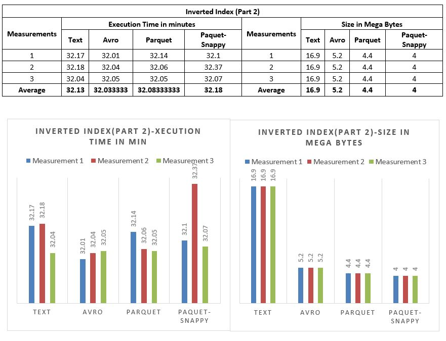
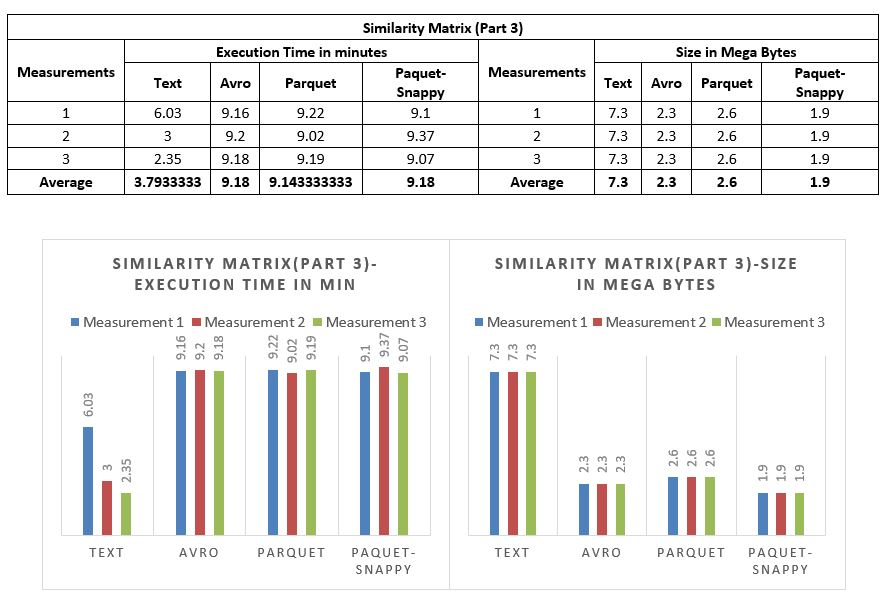

### Hadoop Avro - Parquet Performance Comparission
#### Introduction:
__Avro:__ Avro is a data serialization standard for compact binary format widely used for storing persistent data on HDFS. One of the advantage of using avro is lightweight and fast data serialization and deserialization, which can deliver very good ingestion performance. Avro data can be described through language independent schema.  Hence avro format data can be shared across applications using different languages. Avro formatted files are splittable and compressible and hence good for data storage in HDFS.
__Parquet:__ Parquet is column-oriented data serialization standard for efficient data analytics. Parquet standard can encode and compress files to very less size. It provides good compression up to 75% when used compression formats like snappy. Parquet is well suited for warehouse kind of solutions where aggregation are required on a certain column over a huge set of data.
#### Implementation:
This project is the implementation of converting text outputs of Pairwise Simiarlity Measure to Hadoop's Avro & Parquet file formats and comparing performances.

###### Pairwise Similarity Measure: https://github.com/ibrahimpasha/Pairwise-Similarity-Measure
##### Avro: 
For writing the RDD to a avro file format, I have created SQLContext object from spark context that creates dataframe from RDD. Then used avro package from databricks to write the dataframe into avro file.
```
sqlContext = SQLContext(sc)
df1 = sqlContext.createDataFrame(output, ['word', 'weight'])
df1.write.format("com.databricks.spark.avro").save(outputFiles)
```

For reading the avro files first I have created DataFrame using SQL Context and then converted it to RDD.

`inputAvro = sqlContext.read.format("com.databricks.spark.avro").load(inputFiles).rdd.map(tuple) `

__Observation:__ I have mapped the RDD result from data frame to a tuple because my program reads further RDD as a tuple and without the conversion of tuple I was having trouble accessing elements inside tuple. That made me to not change any of the further code.
##### Parquet: 
For writing the RDD to a parquet file format, I did the same method as I did for avro but written RDD into parquet using parquet package. Included compression option as None as parquet is storing files to default to snappy compressed.
```
sqlContext = SQLContext(sc)
df1 = sqlContext.createDataFrame(output, ['word', 'weight'])
df1.write.option("compression", "none").parquet(outputFiles)
```
For reading the parquet files first I have created DataFrame using SQL Context and then converted it to RDD. And mapped to a tuple as I did in avro.

`inputAvro = sqlContext.read.parquet(inputFiles).rdd.map(tuple)`

I have implemented parquet with snappy compression using compression option in parquet packet while writing into parquet file like below.

`df1.write.option("compression", "snappy").parquet(outputFiles)`

For each file format text, avro, parquet without compression and parquet with snappy compression, I took three measurements each and calculated average times and storage occupied by files. Results are provide in results section.
#### Steps to Run the code:
##### Text format:
1.	Inverted Index Text:

`spark-submit --master yarn --deploy-mode cluster --conf spark.ui.port=4070 --num-executors 5 --executor-cores 3  --executor-memory 10G pyspark_inverted_index.py /bigd43/hw3/1000_most_M/* /cosc6339_hw2/gutenberg-500/* /bigd43/hw3/inverted_text_M_1`

2.	Similarity Text:

```spark-submit --master yarn --deploy-mode cluster --conf spark.ui.port=4070 --num-executors 5 --executor-cores 3  --executor-memory 10G pyspark_similarity_matrix.py /bigd43/hw3/inverted_text_M_1 /bigd43/hw3/similarity_text_M_1```

##### Avro format:
1.	Inverted Index Avro:

```spark-submit --master yarn --deploy-mode cluster --conf spark.ui.port=4070 --num-executors 5 --executor-cores 3  --executor-memory 10G inverted_index_avro.py /bigd43/hw3/1000_most_M/* /cosc6339_hw2/gutenberg-500/* /bigd43/hw3/inverted_avro_M_1```

2.	Similarity Matrix Avro:

```spark-submit --master yarn --deploy-mode cluster --conf spark.ui.port=4070 --num-executors 5 --executor-cores 3  --executor-memory 10G similarity_matrix_avro.py /bigd43/hw3/inverted_avro_M_1/*.avro /bigd43/hw3/similarity_avro_M_1```

##### Parquet - Uncompressed:
1.	Inverted Index Parquet:

```spark-submit --master yarn --deploy-mode cluster --conf spark.ui.port=4070 --num-executors 5 --executor-cores 3  --executor-memory 10G inverted_index_parquet.py /bigd43/hw3/1000_most_M/* /cosc6339_hw2/gutenberg-500/* /bigd43/hw3/inverted_parquet_M_1```
2.	Similarity Matrix Parquet:

```spark-submit --master yarn --deploy-mode cluster --conf spark.ui.port=4070 --num-executors 5 --executor-cores 3  --executor-memory 10G similarity_matrix_parquet.py /bigd43/hw3/inverted_parquet_M_1/*.parquet /bigd43/hw3/similarity_parquet_M_1```
##### Parquet - Snappy:
1.   Inverted Index Parquet Snappy:

```spark-submit --master yarn --deploy-mode cluster --conf spark.ui.port=4070 --num-executors 5 --executor-cores 3  --executor-memory 10G inverted_index_parquet_snappy.py /bigd43/hw3/1000_most_M/* /cosc6339_hw2/gutenberg-500/* /bigd43/hw3/inverted_parquet_snappy_M_1```

2.   Similarity Matrix Parquet Snappy:

```spark-submit --master yarn --deploy-mode cluster --conf spark.ui.port=4070 --num-executors 5 --executor-cores 3  --executor-memory 10G similarity_matrix_parquet_snappy.py /bigd43/hw3/inverted_parquet_M_1/*.parquet /bigd43/hw3/similarity_parquet_snappy_M_1```

#### Resources Used:
1.	Hadoop version 3.0.3
2.	Python version 2.7.13
3.	Pyspark version 2.2.2
4.	Avro version 1.8.2
5.	Whale Cluster
4.	Whale Cluster
   - a.	50 Appro 1522H nodes (whale-001 to whale-057), each node with
     - i.	two 2.2 GHz quad-core AMD Opteron processor (8 cores total)
     - ii.	16 GB main memory
     - iii.	Gigabit Ehternet
     - iv.	4xDDR InfiniBand HCAs (not used at the moment)
   - b.	Network Interconnect
     - i.	144 port 4xInfiniBand DDR Voltaire Grid Director ISR 2012 switch (donation from TOTAL)
     - ii.	two 48 port HP GE switch
   - c.	Storage
     - i.	4 TB NFS /home file system (shared with crill)
     - ii.	~7 TB HDFS file system (using triple replication)
#### Results Section:
##### Inverted Index:

#### Observation: 
From the results of Part -2 what I observed is that, even though the file formats text, avro, parquet without compression and parquet with snappy compression are used the execution time seemed to be relatively same having average execution time similar to other file formats but observable difference is there. Writing into text file format took little bit of extra time than writing into avro or parquet file formats. Parquet with snappy compression took more time than any other compared file format above. This I believe, since parquet snappy has to be stored in compressed format, it took little bit extra time for compressing files. When it comes to storage, text format files are occupying more space than avro, parquet without compression and parquet with snappy compression.  Avro stored files in 3x times smaller than that of text file format and parquet with snappy compression took 4x smaller space than text files.

##### Similarity Matrix:


#### Observations:
From the results of part 3 what I observed is that for (part 2), Execution time seemed to be relatively same for the file formats avro, parquet without compression and parquet with snappy compression except for the text file formats. Reading from text files took less time than that of other file formats. This I believe since text file format is directly read as RDD whereas avro and parquet files are read as DataFrames first and then converted to RDD. I believe this conversion might be the reason that caused the execution time to take little bit extra time than that of text files. When it comes to storage, text format files are occupying more space than avro, parquet without compression and parquet with snappy compression.  Avro stored files in 3x times smaller than that of text file format and parquet with snappy compression took 4x smaller space than text files. There has been peculiar observation where parquet without compression file format took little bit of extra space than avro file format. This I believe parquet will not store files with less storage than avro all the time. Sometime avro performs better than parquet when there are large number of small files.
